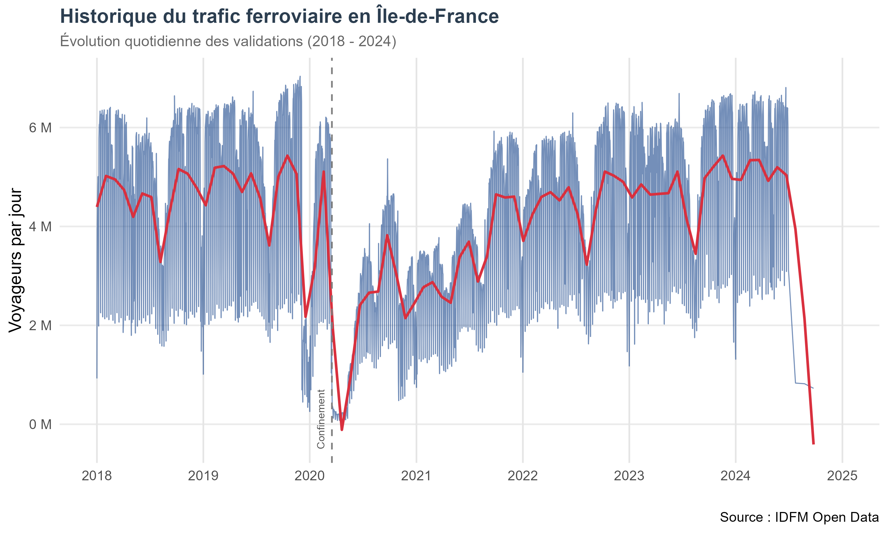
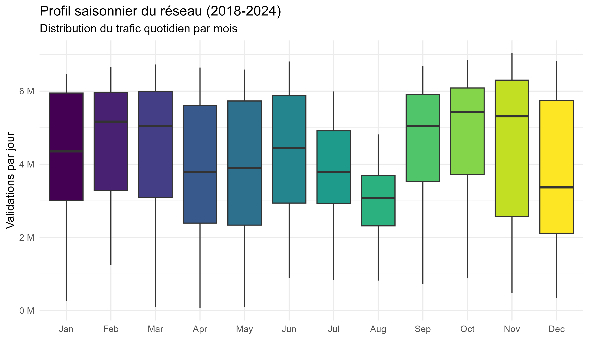
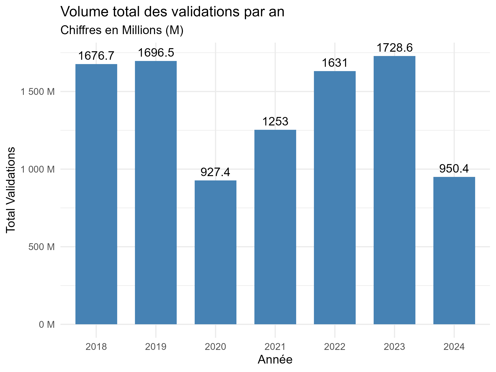
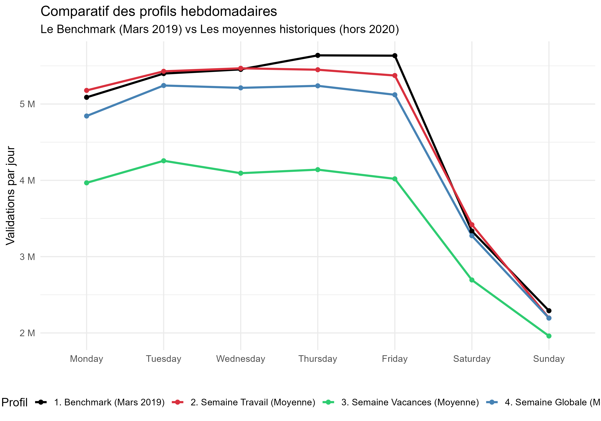
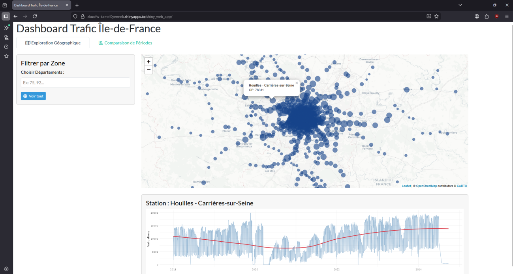
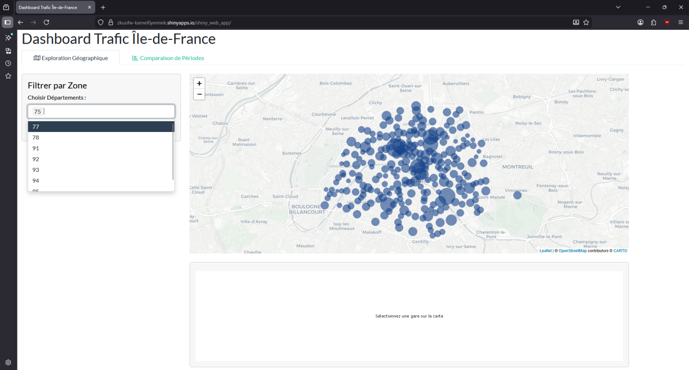
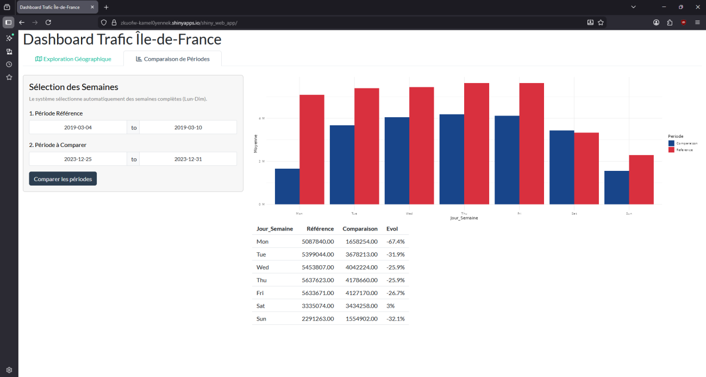

```{r}
#| label: setup
#| include: false
library(tidyverse)
library(lubridate)
library(sf)
```

# 1. Introduction
Public transport planning in Île-de-France relies heavily on detailed knowledge of passenger flows over time and space.
This report analyses smart-card validations on the rail network between 2018 and 2024 to characterise long-term trends, seasonal patterns, and deviations from a “normal” week during holiday periods.

The objectives are threefold:

- To build a reproducible cleaning pipeline that consolidates heterogeneous raw files into a consistent analytical dataset at the stop-area level.

- To perform exploratory data analysis (EDA) on daily, monthly and yearly ridership indicators for the whole network.

- To define and compare reference and holiday weeks, as a basis for a Shiny dashboard that allows interactive exploration of ridership patterns.

# 2. Data and tools
## 2.1 Data sources
The analysis is based on open data provided by Île-de-France Mobilités, including:

- Semester-level rail validation files from 2018 to 2024, with one record per day, stop and ticket category.

- A spatial reference file of “Zones d’arrêt” (stop areas), used to attach geographical coordinates and station names to each stop identifier.

In this report, the study period is restricted to 1 January 2018 – 31 December 2024, and validations are aggregated at the stop-area level defined by the identifier ID_REFA_LDA.

## 2.2 Software and R packages
All computations and figures are produced in R (`version X.Y.Z`) using the following packages:

- ``tidyverse`` for data manipulation (`dplyr, tidyr, readr`) and plotting (`ggplot2`).

- ``lubridate`` for date parsing and handling of temporal variables.

- ``sf`` for reading and transforming the spatial stop-area reference data.

The full analysis is implemented in a reproducible way inside this Quarto document, which can be rendered to PDF or HTML.

# 3. Response to the questions

## 3.1. Data preprocessing and cleaning
Before performing any analysis, all raw IdFM files are processed by a dedicated R script `cleaning.R` stored in the project directory.  
This script implements the full cleaning and aggregation pipeline described in Section 3.1 and produces the final dataset `data_clean.rds` that is used throughout the rest of the report.


### 3.1.1 Reading and concatenating raw yearly files


The raw validation data are provided as semester-based text files for each year between 2018 and 2024.  
For every year, the script imports the two semester files using the function `read.delim()`, but a few files require specific options.  
In particular, the second semester of 2022 uses a semicolon as separator, so we explicitly set `sep = ";"` when reading `validation_2_trim_2022`.  
In 2023, the second semester file is encoded in `UTF-16LE`, which is handled by passing `fileEncoding = "UTF-16LE"` to `read.delim()`.  
Finally, in 2024 the second validation file is named `2024_T3_NB_FER.txt` instead of following the usual `S2` pattern, and is therefore read into the object `validation_2_trim_2024` using its actual file name.

Each semester file is stored in a separate object (e.g. `validation_1_trim_2018`, `validation_2_trim_2018`, …, `validation_2_trim_2024`), and all these objects are then combined into a single list called `liste_dfs`.  
This list structure allows us to apply exactly the same cleaning function to every semester, instead of repeating the same code fourteen times, and ensures that the processing pipeline is compact and reproducible.

```{r}
#| label: import-raw-illustration
#| eval: false
# Example: importing one semester and storing all tables in a list
validation_1_trim_2018 <- read.delim("data/data-rf-2018/2018_S1_NB_FER.txt")
validation_2_trim_2018 <- read.delim("data/data-rf-2018/2018_S2_NB_FER.txt")
liste_dfs <- list(validation_1_trim_2018, validation_2_trim_2018, ...)

```

### 3.1.2 Harmonising column names and types

The historical files do not all share the same schema, so we define a dedicated function ``clean_valid_type()`` that is applied to each element of ``liste_dfs``.
Inside this function, we first standardise the stop-area identifier by renaming any column called ``lda`` or ``ID_ZDC`` into a common field ``ID_REFA_LDA``, which will later be used as the key for spatial joins.

The function then enforces consistent data types across all years: network and stop codes are cast to character (``CODE_STIF_RES, CODE_STIF_ARRET``), the validation count NB_VALD is converted to integer, and the date JOUR is parsed as a Date using flexible formats (``ymd`` or ``dmy``).
Once ``clean_valid_type()`` has been applied to all elements of liste_dfs via purrr::map(), the cleaned tables are concatenated row-wise with bind_rows() to form a single historical dataset ``df`` covering all days, stops and ticket categories between 2018 and 2024.
```{r}
#| label: clean-types-illustration
#| eval: false
clean_valid_type <- function(df) {
  df %>%
    rename_with(~ ifelse(. %in% c("lda", "ID_ZDC"), "ID_REFA_LDA", .)) %>%

    mutate(
      CODE_STIF_RES   = as.character(CODE_STIF_RES),
      CODE_STIF_ARRET = as.character(CODE_STIF_ARRET),
      NB_VALD         = as.integer(NB_VALD),
      JOUR            = as.Date(parse_date_time(JOUR, orders = c("ymd", "dmy")))
    )
}

liste_dfs_clean <- map(liste_dfs, clean_valid_type)

df <- bind_rows(liste_dfs_clean)
```

### 3.1.3 Handling missing values and inconsistent records

The consolidated dataset df is then examined for data quality issues by counting missing values per column and isolating problematic rows.
We specifically identify records where the stop code ``CODE_STIF_ARRET ``or the network code ``CODE_STIF_RES`` is missing or empty, as well as rows where the stop label ``LIBELLE_ARRET`` is equal to “Inconnu”, which correspond to locations that cannot be reliably mapped to a real station.

To avoid keeping such ambiguous observations, all rows with ``LIBELLE_ARRET == "Inconnu"`` are removed, and the difference between the initial and final values of ``nrow(df)`` is used to quantify how many records are removed by this filter.
We also investigate the distribution of the main ridership variable ``NB_VALD``, verify that there are no negative counts, and drop all rows where ``NB_VALD`` is missing, which correspond to incomplete or non-numeric records in the raw files.

Finally, the time span of the study is enforced by keeping only dates between 1 January 2018 and 31 December 2024 through a simple filter on the JOUR column.
At this stage, ``df`` contains only valid records with non-missing stop and network codes, a non-missing validation count, and dates lying strictly inside the project period.

```{r}
#| label: clean-missing-illustration
#| eval: false
nb_avant <- nrow(df)
df <- df %>%
  filter(LIBELLE_ARRET != "Inconnu")


df <- df %>%
  filter(JOUR >= as.Date("2018-01-01") & JOUR <= as.Date("2024-12-31"))

```

### 3.1.4 Recoding ticket categories
The original ticket category variable ``CATEGORIE_TITRE`` contains numerous labels with typographical variants and encoding issues (for example “IMAGINE R” vs “Imagine R”, or different spellings for solidarity contracts).
To make the analysis more robust and readable, we recode these raw labels into a limited set of synthetic categories that group similar products together.

In practice, the script uses a ``case_match()`` statement to map several original labels into a single target category.
The main groups are: “Imagine R” (student passes), “Forfait Navigo” (standard season tickets), “Contrat Solidarité Transport” (solidarity fares), “Amethyste”, “Forfaits courts” (short-duration products), “Forfait Gratuité Transport” (FGT), “NON DEFINI”, and a residual group “Autres titres” that absorbs any remaining labels not explicitly listed.

This transformation reduces noise in the typology of tickets and allows comparisons between a small number of meaningful product families instead of many rarely used labels.
```{r}
#| label: recode-tickets-illustration
#| eval: false
df <- df %>%
  mutate(CATEGORIE_TITRE = case_match(CATEGORIE_TITRE,
    
    # 1. IMAGINE R
    c("IMAGINE R", "Imagine R") ~ "Imagine R",
    
    # 2. FORFAIT NAVIGO
    c("NAVIGO", "Forfait Navigo") ~ "Forfait Navigo",
    
    # 3. CONTRAT SOLIDARITE (TST + bug encodage)
    c("TST", "Contrat Solidarité Transport", "Contrat Solidarit\xe9 Transport") ~ "Contrat Solidarité Transport",
    
    # 4. AMETHYSTE
    c("AMETHYSTE", "Amethyste") ~ "Amethyste",
    
    # 5. FORFAITS COURTS
    c("NAVIGO JOUR", "Forfaits courts") ~ "Forfaits courts",
    
    # 6. FGT Forfait Gratuité Transport
    "FGT" ~ "Forfait Gratuité Transport",
    
    # 7. NON DEFINI
    c("?", "NON DEFINI") ~ "NON DEFINI",
    
    # 8. TOUT LE RESTE -> Autres titres
    .default = "Autres titres"
  ))

```

​

### 3.1.5 Aggregation to stop-area level and spatial join
After cleaning, the dataset still contains one row per original record, which can correspond to very fine ticket or device details.
For network-level analysis and mapping, we aggregate these records to a more synthetic level by grouping on JOUR and ID_REFA_LDA only, and summing NB_VALD within each group.

This aggregation produces a compact table df_agg where each row corresponds to the total daily ridership of a given stop-area, with variables JOUR, ID_REFA_LDA and the aggregated count NB_VALD.
This step drastically reduces the number of rows while preserving all the information needed about when and where validations take place.

To enable geographical visualisations, we then join df_agg with the spatial reference of stop areas, which is stored as a shapefile containing the polygons of “Zones d’arrêt”.
The spatial file is read with the sf package and transformed to the standard WGS84 coordinate system.

For each zone, we compute its centroid and extract its longitude and latitude, keeping only a few attributes: the stop-area identifier ID_REFA_LDA, the station name NOM_GARE, the municipality VILLE and the coordinates LON and LAT.
A left join between df_agg and this cleaned spatial table geo_clean yields the final analytical dataset df_final, which combines daily ridership with station names and geographic coordinates and is saved as data_clean.rds for later use in the EDA and the Shiny dashboard.

```{r}
#| label: agg-geo-illustration
#| eval: false
# Aggregation by day, stop-area and ticket family
df_agg <- df %>%
  group_by(JOUR, ID_REFA_LDA, CATEGORIE_TITRE) %>%
  summarise(NB_VALD = sum(NB_VALD, na.rm = TRUE), .groups = "drop")

# Spatial reference of stop areas (simplified workflow)
geo_shp <- st_read("data/geo/PL_ZDL_R_07-01-2026.shp")
geo_clean <- geo_shp %>%
  st_transform(4326) %>%
  st_centroid() %>%
  mutate(
    LON         = st_coordinates(.)[, 1],
    LAT         = st_coordinates(.)[, 2],
    ID_REFA_LDA = as.numeric(idrefa_lda)
  ) %>%
  st_drop_geometry() %>%
  select(ID_REFA_LDA, NOM_GARE = nom_lda, VILLE = commune, LON, LAT)

df_final <- df_agg %>%
  left_join(geo_clean, by = "ID_REFA_LDA")


```

This final table df_final is the main input for all subsequent exploratory analyses and for the Shiny dashboard, since it combines daily ridership by stop-area with station names and geographic coordinates.


## 3.2 Exploratory data analysis

### 3.2.1 Daily network-wide ridership


### 3.2 Exploratory data analysis

The exploratory analysis uses the cleaned dataset `df` stored in `data_clean.rds` and rebuilt in `02_analysis.R`.  
From this table, three aggregated indicators are computed to study global trends, monthly seasonality and potential outliers in daily ridership.

### 3.2.1. Global
The first indicator focuses on the overall evolution of rail ridership between 2018 and 2024.  
Figure \@ref(fig:fig-trafic-global) displays the daily total number of validations on the network together with a smooth trend line, highlighting long-term changes in demand.

```{r}
#| label: fig-trafic-global
#| echo: false
#| fig-cap: "Global evolution of daily rail ridership in Île-de-France (2018–2024)."
#| fig-width: 10
#| fig-height: 5


```
The figure shows a high and relatively stable level of traffic in 2018–2019, followed by an abrupt collapse in 2020 when the first COVID‑19 lockdown is introduced, then a gradual recovery from 2021 onwards.
Superimposed on this long-term pattern, strong weekly oscillations are visible, with higher validations on working days and lower levels on weekends, and several pronounced drops during summer and end‑of‑year periods that correspond to holiday effects and temporary disruptions.


#### 3.2.2 Monthly seasonality

To investigate seasonality, a monthly factor Mois is created from JOUR using month(JOUR, label = TRUE, abbr = TRUE), and daily totals are recomputed in the table trafic_mensuel.
Figure @ref(fig:fig-trafic-month) summarises the distribution of daily ridership for each month over the 2018–2024 period using boxplots.

```{r}
#| label: fig-trafic-month
#| echo: false
#| fig-cap: "Seasonal profile of daily rail ridership by month (2018–2024)."
#| fig-width: 10
#| fig-height: 5


```
The monthly boxplots reveal a clear seasonal pattern: winter and early spring months are associated with lower medians and longer lower tails, while September to November exhibit higher central values and more concentrated distributions.
July and August, in contrast, show both lower median levels and a wider spread, confirming the strong reduction and increased variability of demand during summer holidays compared with the rest of the year.


#### 3.2.3 Annual evolution and anomalous years

Long-term evolution is summarised by constructing an annual table trafic_annuel, where Annee = year(JOUR) and Total = sum(NB_VALD) are computed for each calendar year, keeping only complete years up to 2024.
Figure @ref(fig:fig-trafic-year) displays these totals as a bar chart, with the yearly volume of validations expressed in millions on top of each bar.

```{r}
#| label: fig-trafic-year
#| echo: false
#| fig-cap: "Yearly total validations on the rail network (2018–2024)"
#| fig-width: 10
#| fig-height: 5


```

This annual view confirms that 2019 is the last “normal” pre‑pandemic year with high ridership, while 2020 stands out as a clear anomalous year with a drastic drop in traffic.
Subsequent years show a progressive rebound in 2021 and 2022, a level in 2023 slightly above 2019, and a lower total in 2024, indicating that ridership has not yet fully stabilised and that the impact of the pandemic remains visible in the long-term statistics.


### 3.3 Comparison with a reference week

#### 3.3.1 Construction of daily and weekly profiles

To compare “normal” and holiday periods, the cleaned dataset `df` is first aggregated by date into a daily table `df_jour`, where each row contains the total network ridership `Total_Reseau = sum(NB_VALD)` for a given `JOUR`.  
For every day, we derive three additional variables: the calendar year `Annee = year(JOUR)`, the month `Mois = month(JOUR)`, and the day of week `Jour_Semaine = wday(JOUR, label = TRUE, abbr = FALSE, week_start = 1)`, which ensures that all weekly profiles start on Monday. 

Because 2020 is heavily affected by the COVID‑19 crisis, this year is excluded from the computation of historical averages, leading to a filtered table `df_clean_stats = df_jour %>% filter(Annee != 2020)`.  
All weekly profiles used in the comparison are then derived from `df_jour` and `df_clean_stats` by averaging `Total_Reseau` by `Jour_Semaine` under different calendar conditions.

#### 3.3.2 Definition of benchmark and average weeks

Four distinct weekly profiles are constructed:

- A benchmark week `profil_benchmark`, corresponding to the period from 4 to 10 March 2019 (`2019-03-04` to `2019-03-10`), chosen as a typical pre‑COVID working week without holidays or major disruptions.  
  This profile keeps the original `Total_Reseau` values by `Jour_Semaine` and assigns `Type = "1. Benchmark (Mars 2019)"`.

- A working-week profile `profil_travail`, obtained by restricting `df_clean_stats` to the “working” months January, February, March and November (`Mois %in% c(1, 2, 3, 11)`), then averaging `Total_Reseau` by `Jour_Semaine` via `summarise(Valeur = mean(Total_Reseau))`.  
  The resulting rows are labelled `Type = "2. Semaine Travail (Moyenne)"`.

- A holiday-week profile `profil_vacances`, built from the same `df_clean_stats` but keeping only July and August (`Mois %in% c(7, 8)`), and again computing the mean `Total_Reseau` by `Jour_Semaine`.  
  This profile is tagged as `Type = "3. Semaine Vacances (Moyenne)"`.

- A global average week `profil_global`, obtained by averaging `Total_Reseau` by `Jour_Semaine` over all days in `df_clean_stats` without any seasonal filter, and labelled `Type = "4. Semaine Globale (Moyenne)"`.

The four profiles are concatenated with `bind_rows()` into a single table `donnees_comparatives`, which is then passed to `ggplot()` to produce the comparative chart shown in Figure \@ref(fig:fig-profils-hebdo).

```{r}
#| label: fig-profils-hebdo
#| echo: false
#| fig-cap: "Benchmark and average weekly ridership profiles (excluding 2020)."
#| fig-width: 10
#| fig-height: 6

```

#### 3.3.3 Interpretation of the weekly comparison

The weekly profiles plotted in Figure \@ref(fig:fig-profils-hebdo) all share the same general shape: ridership increases from Monday to Thursday, reaches its highest level on Thursday and Friday, then drops sharply on Saturday and even more on Sunday.  
This confirms that the rail network is primarily driven by commuting activity on weekdays, with weekends systematically showing much lower demand. 

Comparing the four curves highlights the impact of holidays on travel behaviour.  
The working-week average lies slightly above both the benchmark and the global average on most weekdays, reflecting that dense working periods generate the highest volumes.  
In contrast, the holiday-week profile is clearly below the other curves for every day of the week, with gaps of several hundred thousand validations on Mondays to Fridays, which quantifies the reduction in regular trips during summer and school holidays.


## 3.4 Shiny dashboard

All results of the previous sections are made available in an interactive Shiny dashboard, deployed online at:  
`https://zkoufw-kamell@yennek.shinyapps.io/shiny_web_app/`  *(URL à adapter si nécessaire)*.  

The application is built in a single script `app.R` that loads the cleaned dataset `data_clean.rds` and provides two main tabs: a geographical exploration of stations and a weekly comparison tool.

### 3.4.1 Global structure of the app

At start-up, the server reads `df <- readRDS("data_clean.rds")` and prepares a station-level table `df_map` by grouping by `NOM_GARE` and `ID_REFA_LDA`.  
For each station, the mean daily ridership `Trafic_Moyen`, longitude `LON`, latitude `LAT` and a department code `DEPT` (first two digits of `VILLE`) are computed, which are used to filter and size markers on the map. [web:56]

The user interface is organised with `tabsetPanel()` into two tabs:  
- “Exploration Géographique” for spatial filtering and station selection,  
- “Comparaison de Périodes” for comparing two weeks day by day.  

```{r}
#| label: fig-dashboard-overview
#| echo: false
#| fig-cap: "Overall layout of the Shiny dashboard with the two main tabs."
#| fig-width: 10
#| fig-height: 5

```

### 3.4.2 Geographical exploration and station trends

The “Exploration Géographique” tab uses `leaflet` to display one circle marker per station, with radius proportional to `sqrt(Trafic_Moyen)` and colour based on a fixed palette.  
A `selectizeInput("choix_dept")` lets the user filter stations by department, and the “Voir tout” button resets the selection; the map is automatically zoomed to the selected area using `fitBounds()`. 

When the user clicks on a station, the server filters `df` for the chosen `NOM_GARE`, aggregates daily totals by `JOUR`, and generates a local time series with `geom_line()` and `geom_smooth(method = "loess")`.  
This provides an immediate view of how ridership at this specific station has evolved between 2018 and 2024, while the default message invites the user to click on the map if no station is selected. 

```{r}
#| label: fig-dashboard-map
#| echo: false
#| fig-cap: "Geographical tab: department filter and interactive map of stations."
#| fig-width: 10
#| fig-height: 5

```

```{r}
#| label: fig-dashboard-station
#| echo: false
#| fig-cap: "Time series of daily validations for a station selected on the map."
#| fig-width: 10
#| fig-height: 5

```

### 3.4.3 Weekly comparison of two periods

The “Comparaison de Périodes” tab focuses on deviations from a normal week, as required in the assignment.  
Two `dateRangeInput` widgets (`date_ref` and `date_comp`) allow the user to choose a reference period and a comparison period, while the helper function `corriger_dates()` automatically adjusts these selections to full weeks (Monday to Sunday) using `floor_date()` and `ceiling_date()`, with a notification indicating the correction. [web:56]

When the button “Comparer les périodes” is clicked, the server builds `comparaison_data()` by:  
- aggregating `NB_VALD` by `JOUR` inside each period,  
- deriving `Jour_Semaine` with `wday()`,  
- computing the mean daily ridership by day of week for the reference and comparison periods.  

The results are displayed as a bar chart (`geom_col(position = "dodge")`) comparing the two periods for each weekday, and in a summary table where the relative change is given as a percentage.  
This tool lets users quantify, for example, how a holiday week differs from a normal pre‑COVID week, both visually and numerically for each day of the week. 
